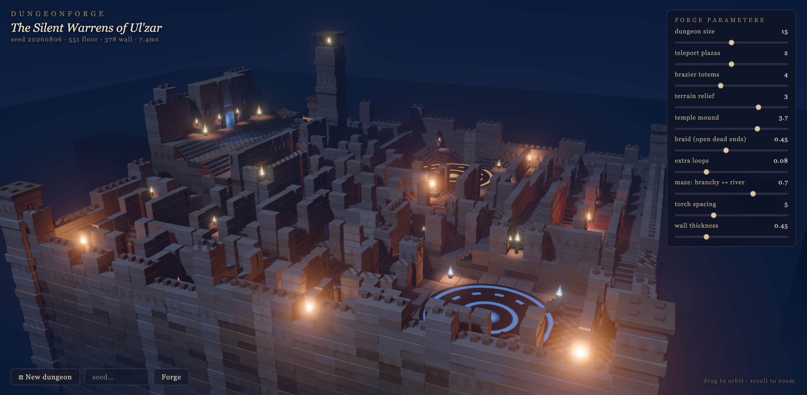
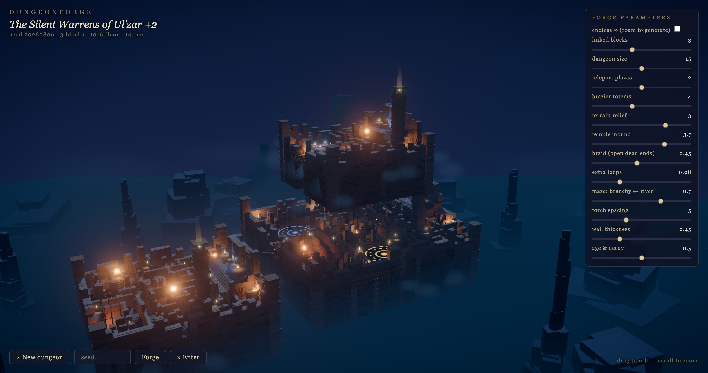
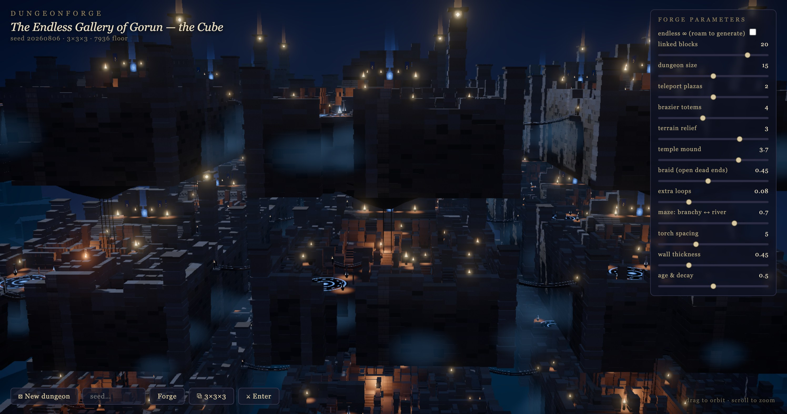
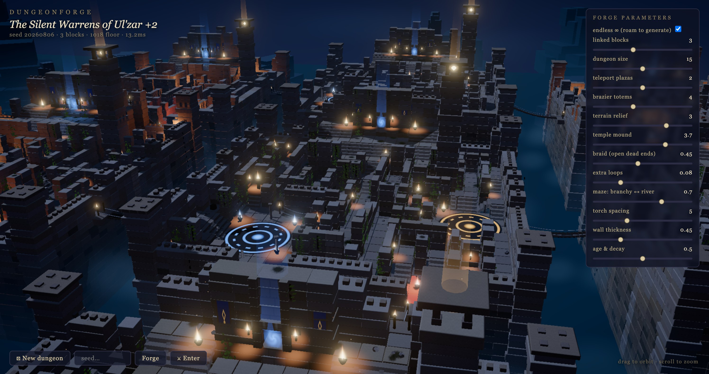

# Dungeonforge

**[Live demo → dungeonforge.pajama.studio](https://dungeonforge.pajama.studio)**
(needs a WebGPU browser — Chrome/Edge, or Safari 26+)

Procedurally generated stone-labyrinth fortress worlds — three.js **WebGPU + TSL**,
fully deterministic per seed, end-to-end in the browser. The dungeon fabric,
materials, effects and dressing are procedural; a small streamed landmark set
supplies the colossal dragon, abyss guardians and player character.



## ✨ Features

- **One seed, one world** — a single integer reproduces everything bit-for-bit:
  maze topology, tiers, landmarks, torches, moss, cracked bricks. No `Math.random`.
- **Chains of dungeon blocks** grown on a macro grid like WFC tiles, linked by
  rope bridges, stacked into sky layers joined by square spiral staircases.
- **Validated before it renders** — full floor connectivity via BFS (Δtier ≤ 1
  moves), legal stairs; failed layouts re-roll a derived seed and never ship.
- **Forge-rise reveal** — new maps assemble island by island, each block rising
  out of the abyss as it is built.
- **Walk everywhere, provably** — the 🧭 route is a 3D BFS over floors, bridges
  and spiral stairs; the 💀 skeleton walks it end to end. Analytic ground
  everywhere — no mesh raycasts, no navmesh.
- **Endless mode** — a streamed 3×3 window follows you; blocks derive from
  `hash(seed, i, j)`, so the infinite world is consistent and free to roam.
- **Per-brick wear** — abraded arrises, randomly chipped corners, pockmarks and
  cracks, all per-instance in one shared stone shader.
- **Per-plaza sigils** — every teleport plaza draws its own pattern and color;
  its brazier ring burns to match.
- **Monuments that tell a story** — the Ziggurat's terraces climb from ruined
  warren to a pristine summit temple (decay fades with height); the Reliquary
  hangs a sealed, fully-decayed vault at the bottom tip of a diamond whose
  crown is immaculate. The narrative IS the generation-parameter gradient.
- **Weathered abyss terrain** — broad low-frequency terraces create readable
  geological plateaus, short eased ramps connect them, and restrained fBM adds
  erosion without turning the floor into noisy vertical cliffs (one static draw).
- **Abyss-scale landmarks** — a rigged dragon on a custom closed rock perch,
  colossal guardians, cemetery silhouettes and distant architecture stream in
  after the playable dungeon reaches its first visible frame.
- **60 fps on a laptop** — instancing, slot-pooled render objects, distance LOD,
  a fixed light pool, and an emissive-threshold bloom chain (see Performance).

## 🚀 Run

```sh
npm install
npm run dev        # → http://localhost:5173
npm test           # generator invariants: determinism, connectivity, stair legality
npm run build      # static bundle in dist/
```

Shareable URLs: `?seed=123&islands=8&size=13` pins a build.

## 🎮 Controls

| Input | Action |
| --- | --- |
| drag / wheel | orbit / zoom (auto-rotate until first drag) |
| **⚄ New dungeon** | forge a random seed |
| seed + **Forge** | forge a specific seed |
| **⚔** | enter the roguelike first-person mode |
| **🎬** | cinematic flythrough (any input exits) |
| **🧭** | draw the 3D route from spawn to the farthest sanctum |
| **🕸** | inspect the walkable/nav surface |
| **💀** | the skeleton walks the whole route — maze, bridges, spiral stairs (Esc stops) |
| **💥** | GPU-scene destruction mode |
| **🐉** | dragon + perch placement gizmo |

The route is a breadth-first search over everything walkable: island floor
grids, rope-bridge crossings and the spiral stair towers. It doubles as the
connectivity proof — every block is reachable from the spawn by construction
(missing gates are carved post-hoc, stair shafts fall back through a
relaxation ladder).

## 🎛 Forge parameters

Every slider re-forges live (debounced):

| Slider | Reshapes |
| --- | --- |
| linked blocks | chain length (1–24 blocks) |
| dungeon size | maze cells per block side |
| teleport plazas / brazier totems | landmark counts |
| terrain relief / temple mound | tier noise amplitude / ziggurat height |
| braid / extra loops | how many dead ends open into loops |
| maze: branchy ↔ river | growing-tree pick-newest bias |
| torch spacing / wall thickness / age & decay | dressing & ruin |

## 🧠 How it works

The generator is **pure data, zero THREE imports** (evidence for each stage in
[docs/research.md](docs/research.md)):

1. growing-tree maze (70/30 newest/random) carving height tiers clamped ±1 per passage
2. braiding — a fraction of dead ends knocked open into loops
3. landmarks stamped graph-first: temple ziggurat, medallion plazas, sunken red
   chamber, ravine + bridge
4. rasterize to a FLOOR/WALL/VOID grid with per-cell tiers
5. connectivity repair: BFS over floor cells, open stair-legal walls until whole
6. stairs / wall heights / towers / torch & banner min-spacing walks
7. validate — or re-roll a derived seed (≤ 6 attempts)

The orchestrator grows a macro layout (tree growth, or a lattice for the Cube,
or an infinite hash-grid for endless mode), generates blocks in a **worker
pool**, and streams them into slot-pooled instanced meshes one per frame.

## 🏗 Architecture

```
src/
  config.ts        world constants (tier height, cell size, budgets, LOD bands)
  gen/             PURE-DATA generator — zero THREE imports
    dungeon.ts       the pipeline above; Layout in/out as typed arrays
    rng.ts           mulberry32 + stateless spatial hashes ("don't generate, hash")
    worker.ts        runs generate() off the main thread (transferable buffers)
    pool.ts          round-robin worker pool, id-tagged so stale replies drop
  scene/
    kit/             shared geometries + TSL materials, built ONCE per session
    instances.ts     InstList — raw-float instance buffers (no per-instance objects)
    slots.ts         per-slot render-object pools + distance LOD + pruning
    build.ts         Layout → instanced meshes (masonry, flames, clutter, lights)
    env.ts           sky (stars/milky way/moon), height fog, moonlight, cliff ring
  render/
    post.ts          bloom + depth-aware volumetric ground fog + vignette
  world/
    context.ts       the Ctx bag threaded through the modes
    forge.ts         chain mode        cube.ts   3×3×3 mode
    stream.ts        endless streaming mode
    spiral.ts        analytic spiral-stair math (pure, unit-tested)
    stairs.ts        stair tower meshes    walkmap.ts  analytic ground sampler
    lights.ts        fixed-size point-light pool     helpers.ts  gates/shafts
  ui/panel.ts      forge-parameter sliders
  player/player.ts the skeleton (gaited GLB locomotion driven by the route)
  main.ts          wiring: renderer, modes, input, main loop (~250 lines)
```

- `scene/build.ts` — layout → instanced meshes. Masonry courses with per-instance
  color (baked AO + hue jitter), TSL flames / banners / medallions / portal,
  fake local torchlight (emissive wall + floor glow quads), per-island point
  lights picked by farthest-point sampling.
- `render/post.ts` — **emissive-threshold bloom** (only flames/sigils glow, stone
  never blooms) + a 7-step depth-aware fog raymarch with moonward forward
  scattering.

## ⚡ Performance notes

60 fps on an M-series laptop; re-forge ≈ 13ms. What mattered:

- **No MSAA under the post chain** (`antialias: false` — 4× bandwidth on two
  attachments was the killer).
- **Shared materials/geometries forever** (module-level kit): WebGPU pipeline
  compilation only ever happens once, so re-forging just refills instance buffers.
- **Slot-pooled render objects**: three's WebGPU renderer builds a node graph
  per render object on first sight (~7ms × ~35 meshes per island) — render
  objects are created once per slot and refilled on regen (9.8s → 30ms).
- **Fixed light pool** (28 points): the WebGPU forward path recompiles every
  pipeline when the scene's light count changes — so it never does; islands
  submit specs and the pool re-aims.
- **Zero-allocation rebuilds**: `InstList` composes instance matrices straight
  into flat `Float32Array`s; bounds come from the translation columns, never
  `computeBoundingSphere`.
- **Baked shadows**: `light.shadow.autoUpdate = false` + `needsUpdate = true`
  per regen (there is no `renderer.shadowMap.autoUpdate` in WebGPU three).
- **Distance LOD with hysteresis**: far slots hide detail layers and swap bulk
  masonry to low-poly boxes; ON below 95 units, OFF above 112 — no swap thrash.
- **Streamed first load**: islands build one per frame (pure JS while nothing
  renders), then `renderer.compileAsync()` compiles every pipeline in parallel
  off the main thread; the overlay lifts on the first drawn frame.
- **Warm-up-safe in background tabs**: the per-island frame spacing falls back
  to a timeout when rAF stops, so a hidden-tab forge finishes instead of stalling.
- Light budget: 1 shadowed directional + the fixed pool of 28 unshadowed points;
  every other torch is emissive flame + wall/floor glow quads.
- Depth reads from **vertex-color face shading** baked into the shared block
  geometry (top/±x/±z faces each get their own value), not from extra lights.

## 📐 three.js / WebGPU version notes (r185)

- `renderAsync()` is deprecated — `await renderer.init()` once, then plain
  `render()`; use `renderer.compileAsync(scene, camera)` for warm-up.
- `THREE.PostProcessing` is being renamed to `THREE.RenderPipeline`.
- TSL's `pointUV` compiles to `gl_PointCoord` — WebGL-only; don't build
  round-point sprites on it.
- Shadow "static mode" is per-light (`light.shadow.autoUpdate/needsUpdate`),
  not a renderer flag.

## 📸 More seeds

| | | |
| --- | --- | --- |
|  |  |  |
| stacked sky layers | the 3×3×3 Cube | endless streaming |

## 📄 License

Code is [MIT](LICENSE). The adventurer is the CC0
[KayKit Adventurers](https://kaylousberg.com) Knight — see
[LICENSES.md](LICENSES.md) for asset credits.
