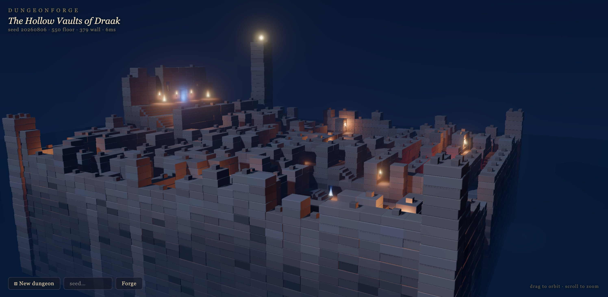

# Dungeonforge

Procedurally generated stone-labyrinth fortress diorama — three.js **WebGPU + TSL**,
fully deterministic per seed, end-to-end in the browser.



One integer seed reproduces the whole fortress bit-for-bit: a braided growing-tree
maze with discrete height tiers, broad staircases climbing to a temple ziggurat,
medallion plazas, a sunken red chamber, a ravine + rope bridge, torch-lit walls,
banners, and a beacon tower — all validated (full floor connectivity via BFS with
Δtier ≤ 1 moves, legal stairs) before it ever renders.

## Run

```sh
npm install
npm run dev        # → http://localhost:5173 (?seed=123 to pin a seed)
npm test           # generator invariants: determinism, connectivity, stair legality
npm run build      # static bundle in dist/
```

## Architecture

- `src/gen/` — **pure-data generator**, zero THREE imports. Pipeline (evidence in
  `docs/research.md`): growing-tree maze (70/30 newest/random) carving tiers clamped
  ±1 per passage → braiding (~45% of dead ends opened into loops) → landmarks stamped
  graph-first (temple, plazas, red chamber, ravine + bridge) → rasterize to a 31²
  FLOOR/WALL/VOID grid → connectivity repair → stairs / wall heights / torch &
  banner min-spacing walks. Re-rolls a derived seed on validation failure.
- `src/scene/build.ts` — layout → instanced meshes. Masonry courses with per-instance
  color (baked AO + hue jitter via `setColorAt`), TSL flames / banners / medallions /
  portal, fake local torchlight (emissive wall + floor glow quads), 9 real point
  lights picked by farthest-point sampling + fixed mood lights.
- `src/scene/env.ts` — AgX night grade support: sky gradient node, `scene.fogNode`
  height fog (triNoise3D) pooling in the abyss, one shadow-casting moon, cliff ring.
- `src/main.ts` — WebGPURenderer, MRT **emissive-only bloom** (only flames/sigils
  glow, stone never blooms), static shadow maps (`shadowMap.autoUpdate = false`,
  baked once per regen).

## Performance notes

60 fps on an M-series laptop; cold load → first frame ≈ 0.9s (dev); re-forge ≈ 13ms.
What mattered:

- **No MSAA on the MRT post chain** (antialias: false — 4× bandwidth on two
  attachments was the killer).
- **Baked shadows**: WebGPU three has no `renderer.shadowMap.autoUpdate` — it's
  per-light: `light.shadow.autoUpdate = false` + `needsUpdate = true` per regen.
- **Shared materials/geometries** across regenerations (module-level cache):
  WebGPU pipeline compilation only ever happens once, so re-forging just refills
  instance buffers.
- **Async warm-up**: `await postProcessing.renderAsync()` before starting the
  loop compiles every pipeline off the hot path; the loading overlay animates
  via compositor-driven CSS meanwhile.
- Light budget: 1 shadowed directional + ~12 unshadowed points; every other
  torch is emissive flame + wall/floor glow quads.
- Depth reads from **vertex-color face shading** baked into the shared block
  geometry (top/±x/±z faces each get their own value; NodeMaterial multiplies
  vertexColor × instanceColor), not from extra lights.
